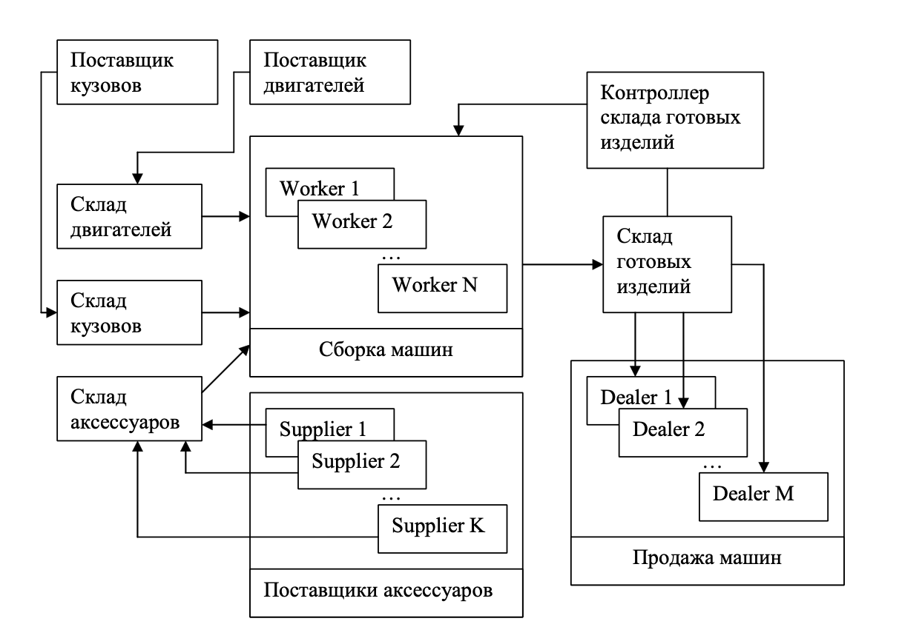

# Задача 4. Эмулятор работы фабрики (многопоточное программирование)

Напишите приложение, эмулирующее работу фабрики по сборке автомашин. Машина состоит из 3-х частей: кузов, двигатель и аксессуары. Машину надо собрать и отвезти на склад, откуда она поступает дилерам. Процесс работы фабрики показан на картинке:



**Технические условия:**

1. Все склады имеют определенный размер, который нельзя превышать. Размеры складов, количество сборщиков, поставщиков и дилеров задаются в конфигурационном файле.
2. Приложение предоставляет графический интерфейс, где можно смотреть основные параметры работы фабрики и контролировать процесс.
3. Каждый сборщик, поставщик и дилер должен работать в отдельном потоке.
4. Для синхронизации и ожидания событий можно использовать мониторы синхронизации (`synchronized/notifyAll/wait`) либо средства из пакета `java.util.concurrent`. Синхронизация "на слипах" (`Thread.sleep`) или холостых циклах (`busy waiting`) не принимается.
5. Каждая деталь - это отдельный объект с уникальным идентификатором. Хранить просто количество изделий/деталей нельзя.
6. Каждый поставщик поставляет одну деталь раз в N миллисекунд. Если какой-то склад деталей полон, то поставщик ожидает освобождения места для деталей. Скорость работы поставщиков определяется 3-мя ползунками (для каждого типа деталей). Должно отображаться кол-во деталей на каждом из складов в текущий момент и кол-во деталей, произведенных поставщиками (для поставщиков аксессуаров можно общий показывать).
7. Каждый дилер запрашивают со склада готовой продукции 1 машину в M миллисекунд. Скорость запрашивания машин можно регулировать ползунком в интерфейсе окна. Интерфейс также должен показывать кол-во произведенных машин (вообще) и кол-во машин на складе в данный момент. При отправке машины дилеру информация о покупке должна писаться в лог работы фабрики (в файл) в виде строки: `<Time>: Dealer <Number>: Auto <ID> (Body: <ID>, Motor: <ID>, Accessory: <ID>)`.
8. Контроллер склада готовой продукции просыпается при любой отправке машины со склада продукции. Он анализирует состояние склада и передает запрос на изготовление новых машин (в случае необходимости) на фабрику.
9. Управлением потоками занимается один или несколько пулов потоков (thread pool). Можно воспользоваться стандартными (см. `java.util.concurrent.Executors`).
10. Задачами для пула потоков являются запросы на создание новых машин (от контроллера склада готовых изделий). При выполнении такой задачи сборщик должен взять по одной детали, необходимой для сборки машины, с соответствующих складов. Если на складе нет нужной детали, то поток ждет поставки. Собирая новую машину, рабочий создает новый объект с помощью всех необходимых объектов, представляющих детали. После этого объект отправляется на склад готовой продукции. Если склад полон, то рабочий ждет освобождения места для новой машины. Интерфейс должен отображать, сколько всего было сделано машин и сколько задач еще ждут исполнителя (в очереди задач).
11. **Код организован согласно MVC, классы объектной модели (деталь, склад, поставщик, сборщик и т.д.) не должны зависеть от библиотеки графического интерфейса.**
12. Конфигурационный файл должен предоставлять настройки для задания вместимости всех складов и количестве всех типов потоков. Примерный список параметров в конфигурационном файле (просьба использовать свои имена):

   ```plain
   StorageBodySize=100
   StorageMotorSize=100
   StorageAccessorySize=100
   StorageAutoSize=100
   AccessorySuppliers=5
   Workers=10
   Dealers=20
   LogSale=true
   ```
13. Программа должна корректно завершаться. При получении сигнала о закрытии окна все потоки должны корректно прерываться, и лог-файл закрываться.

## Дополнительно

На оценку "4" и выше - собственная реализация пула потоков (интерфейс - на ваше усмотрение). Он должен быть реализован в отдельном пакете и не зависеть от остальной системы. Должна быть возможность корректного закрытия пула с завершением всех потоков. Самостоятельно определите стратегию, когда ваш пул создает новые потоки и когда завершает старые, но должны выполняться следующие условия:
1. Нельзя для каждой задачи создавать новый поток, потоки должны переиспользоваться.
2. Максимальное число потоков под управлением пула в любой момент времени - фиксировано (задается в конструкторе).
3. Потоки должны создаваться и закрываться динамически во время работы пула в зависимости от каких-то условий. Нельзя один раз создать N потоков и потом их использовать.
